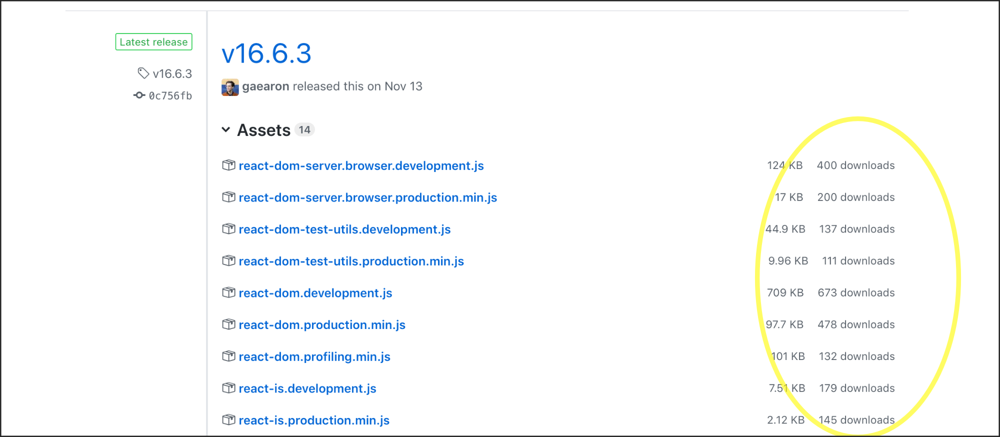

# github-downloads

This is a simple browser extension which adds the number of downloads next to each release asset on the GitHub website.

## Example

Example from the React GitHub repository:

## Credits

Parts of the extension were inspired by [chrome-github-release-downloads](https://github.com/addshore/chrome-github-release-downloads).
