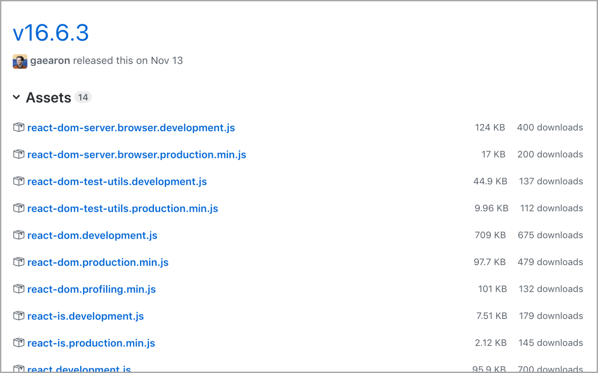

#  GitHub Downloads

This is a simple browser extension which displays the number of downloads next to each release asset on the GitHub website.

* [Install Firefox add-on](https://addons.mozilla.org/en-US/firefox/addon/github-downloads)
* [Install Chrome extension](https://chrome.google.com/webstore/detail/github-downloads/cmccaogaioeflhpfoifgkgchjhifflpk)

*Parts of the extension were inspired by [chrome-github-release-downloads](https://github.com/addshore/chrome-github-release-downloads).*
